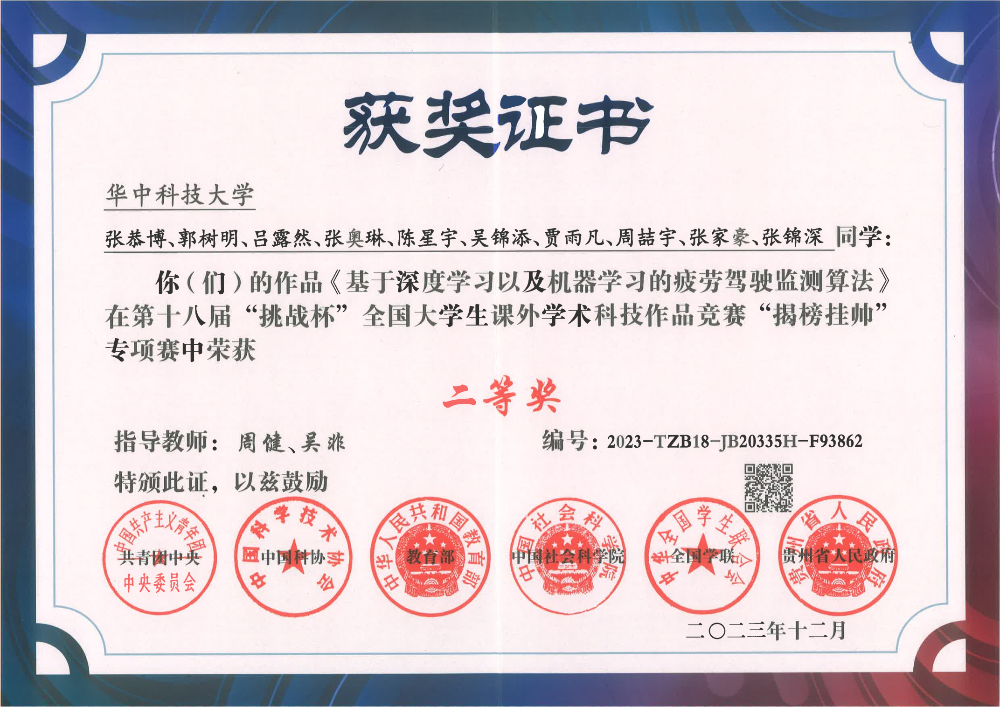

# 18th Challenge Cup National College Students' Extracurricular Academic Science and Technology Works Competition - "Revealing the List and Taking Command" Special Competition · Huawei Cloud Track Second Prize

## Competition Homepage

[Competition Homepage](https://competition.huaweicloud.com/information/1000041855/introduction)

## Certificate



[Certificate Website](https://www.tiaozhanbei.net/ca/CA959D2C14234439A9FA60E65EF93862/)

### Project Overview:

The cloud-based ranking algorithm utilizes `yolov5 + Openvino + Huawei Cloud ModelArts`. It employs binary search and divide-and-conquer algorithms for optimization, allowing for the detection of fatigue states' start and end times without traversing the entire video.

The edge-side (`Jetson TX2 NX`) algorithm uses `Deepstream (C/C++ 6.0.1) + yolov5`. Specific implementation codes include:

- [On-the-Air Model Update](https://docs.nvidia.com/metropolis/deepstream/6.0.1/dev-guide/text/DS_on_the_fly_model.html)
- [Smart Video Record](https://docs.nvidia.com/metropolis/deepstream/6.0.1/dev-guide/text/DS_Smart_video.html)

These implementations are in `C/C++`, as the Python implementation, according to NVIDIA, is currently unfeasible.

Refer to the technical documentation in this directory for detailed implementation.

```plaintext
Team Name: The Big Radish of the Production Team
Program Leader: Gongbo Zhang
Directors: Jian Zhou, Fei Wu
Teammates: Shuming Guo, Luran Lv, Aolin Zhang, Xingyu Chen, Jintian Wu, Yufan Jia, Zheyu Zhou, Jiahao Zhang, Jinshen Zhang

Acknowledgments: Minhan Tang, Yongye Lai, Haoyu Deng, Shiyu Zhang
```

## *License*

This project is released under the [Apache 2.0 license](LICENSE).

```
Copyright 2023 Gongbo Zhang

Licensed under the Apache License, Version 2.0 (the "License");
you may not use this file except in compliance with the License.
You may obtain a copy of the License at the following link.

     http://www.apache.org/licenses/LICENSE-2.0

Unless required by applicable law or agreed to in writing, software
distributed under the License is distributed on an "AS IS" BASIS,
WITHOUT WARRANTIES OR CONDITIONS OF ANY KIND, either express or implied.
See the License for the specific language governing permissions and
limitations under the License.
```
